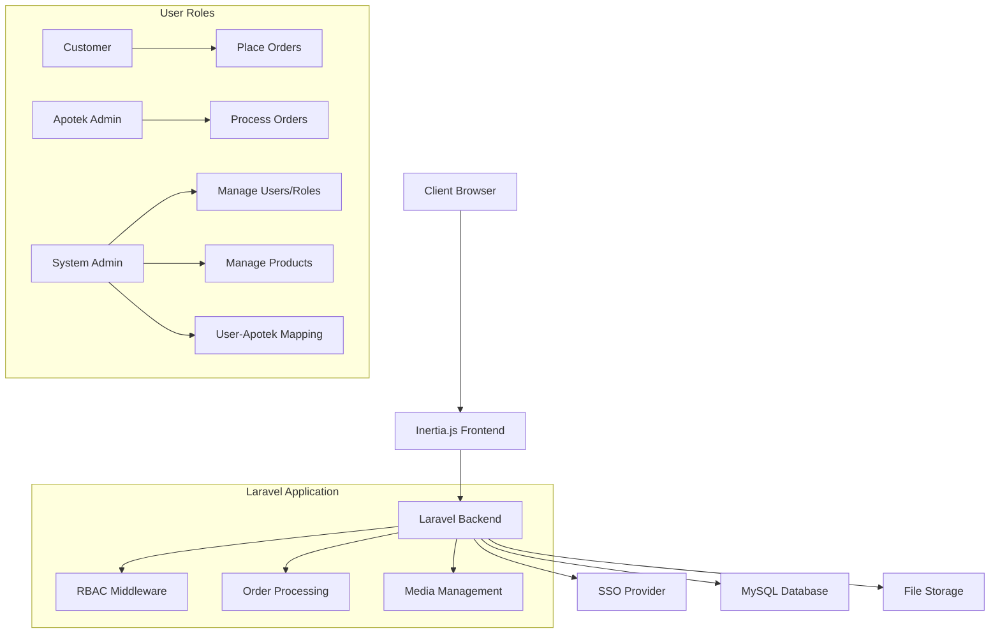
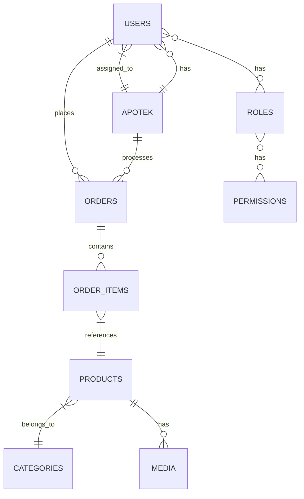

# Micro E-Commerce Web App

A pharmaceutical e-commerce platform built with Laravel 12 and React using the Inertia.js stack. The application
features role-based access control, SSO authentication, and a complete order management system for medications.

## Table of Contents

- [Features](#features)
- [Technical Stack](#technical-stack)
- [Architecture](#architecture)
- [Prerequisites](#prerequisites)
- [Installation](#installation)
- [Development](#development)
- [Testing](#testing)
- [Building for Production](#building-for-production)
- [Deployment](#deployment)
- [Database Schema](#database-schema)
- [Role Definitions](#role-definitions)
- [API Endpoints](#api-endpoints)
- [Security Measures](#security-measures)
- [Performance Optimizations](#performance-optimizations)

## Features

### Authentication & Authorization

- SSO (Single Sign-On) integration
- Role-Based Access Control (RBAC) with Spatie permissions
- Three distinct user roles: Customer, Apotek Admin, System Admin
- Middleware protection for role-specific routes

### Customer Features

- Product browsing and search
- Shopping cart functionality
- Order placement system
- Order history and tracking

### Apotek Admin Features

- Order management dashboard
- Order status updates (processing, shipped, delivered)
- Inventory management for assigned apotek

### System Admin Features

- Comprehensive user management
- Role and permission management
- Category management
- Product catalog management
- Apotek (Store) Management
- User-to-apotek mapping system

### Media Management

- Product image upload and management
- Digital asset organization with Spatie Media Library
- Responsive image handling

## Technical Stack

### Backend

- **Framework**: Laravel 12
- **Authentication**: SSO integration for role user, standard login for admins
- **Authorization**: spatie/laravel-permission (RBAC)
- **Media Management**: spatie/laravel-medialibrary
- **Resources**: Laravel Resources for data passing to inertia
- **Database**: MySQL with Eloquent ORM

### Frontend

- **Framework**: React 19 with TypeScript
- **Integration**: Inertia.js
- **UI Components**: shadcn/ui with Tailwind CSS v4
- **State Management**: React Context + Inertia shared data
- **Form Handling**: Inertia Form

### Development & Deployment

- **Local Development**: Laravel Sail/Docker
- **Testing**: Pest PHP
- **Deployment**: Forge/Vapor compatible
- **Monitoring**: Laravel Telescope

## Architecture



## Prerequisites

- PHP 8.3 or higher
- Composer
- Node.js 18+ and npm
- MySQL 8.0 or higher
- Docker (optional, for containerized development)

## Installation

1. **Clone the repository**:
   ```bash
   git clone <repository-url>
   cd kdmpxkfa
   ```

2. **Install PHP dependencies**:
   ```bash
   composer install
   ```

3. **Install JavaScript dependencies**:
   ```bash
   npm install
   ```

4. **Environment configuration**:
   ```bash
   cp .env.example .env
   php artisan key:generate
   ```
   Configure database and SSO credentials in `.env`

5. **Database setup**:
   ```bash
   php artisan migrate --seed
   ```

## Development

To start the development server:

```bash
# Using Laravel Sail (Docker)
./vendor/bin/sail up -d

# Or using the composer script
composer run dev
```

This will start:

- Laravel backend server
- Queue worker
- Vite development server for frontend

The application will be available at `http://localhost:8000`.

## Testing

Run the test suite:

```bash
# Run all tests
composer test

# Or using the test script
composer run test
```

The project includes:

- Unit tests for models and services
- Feature tests for critical workflows
- Authentication and authorization tests
- Order processing flow tests
- React component testing

## Building for Production

To build the application for production:

```bash
# Build frontend assets
npm run build
```

## Deployment

The application is compatible with Laravel Forge and Vapor. For manual deployment:

1. Configure SSO credentials in production environment
2. Set up queue workers for email notifications
3. Configure filesystem for media storage
4. Schedule periodic tasks for order reminders

## Database Schema



## Role Definitions

| Role         | Permissions                                                                 |
|--------------|-----------------------------------------------------------------------------|
| Customer     | Browse products, place orders, view order history                           |
| Apotek Admin | Process orders, update order status                                         |
| System Admin | Manage users, roles, permissions, products, categories, user-apotek mapping |

## Security Measures

- CSRF protection
- XSS prevention
- SQL injection prevention via Eloquent
- Role-based middleware protection
- Secure file upload validation
- SSO token validation

## Performance Optimizations

- Eager loading for relational data
- Database indexing for frequent queries
- Caching for permission checks and static data
- Image optimization and responsive formats
- Pagination for large datasets
