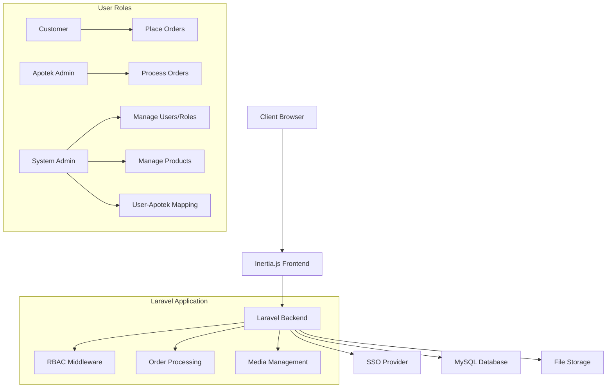
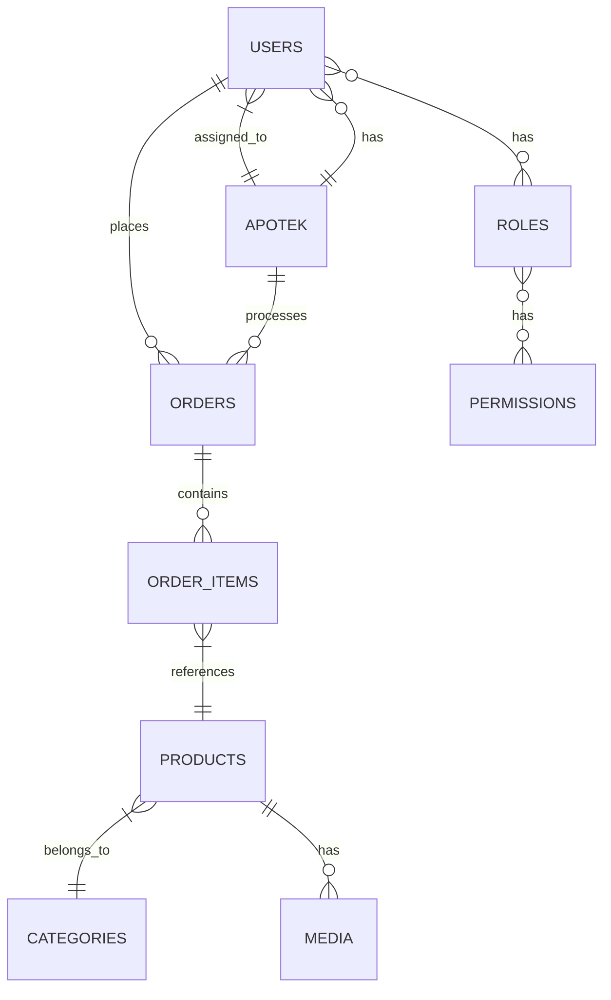

# Micro E-Commerce Web App - Developer Resume

## Project Overview

A pharmaceutical e-commerce platform built with Laravel 12 and React using the Inertia.js stack. The application features role-based access control, SSO authentication, and a complete order management system for medications.

## Technical Stack

### Backend
- **Framework**: Laravel 12
- **Authentication**: SSO integration for role user, standard login for admins
- **Authorization**: spatie/laravel-permission (RBAC)
- **Media Management**: spatie/laravel-medialibrary
- **Resources**: Laravel Resources for data passing to inertia
- **Database**: MySQL with Eloquent ORM

### Frontend
- **Framework**: React 19 with TypeScript
- **Integration**: Inertia.js
- **UI Components**: shadcn/ui with Tailwind CSS v4
- **State Management**: React Context + Inertia shared data
- **Form Handling**: Inertia Form

### Development & Deployment
- **Local Development**: Laravel Sail/Docker
- **Testing**: Pest PHP
- **Deployment**: Forge/Vapor compatible
- **Monitoring**: Laravel Telescope

## Architecture Highlights



## Key Features Implemented

### Authentication & Authorization
- ✅ SSO (Single Sign-On) integration
- ✅ Role-Based Access Control (RBAC) with Spatie permissions
- ✅ Three distinct user roles: Customer, Apotek Admin, System Admin
- ✅ Middleware protection for role-specific routes

### Customer Features
- ✅ Product browsing and search
- ✅ Shopping cart functionality
- ✅ Order placement system
- ✅ Order history and tracking

### Apotek Admin Features
- ✅ Order management dashboard
- ✅ Order status updates (processing, shipped, delivered)
- ✅ Inventory management for assigned apotek

### System Admin Features
- ✅ Comprehensive user management
- ✅ Role and permission management
- ✅ Category management
- ✅ Product catalog management
- ✅ Apotek (Store) Management
- ✅ User-to-apotek mapping system

### Media Management
- ✅ Product image upload and management
- ✅ Digital asset organization with Spatie Media Library
- ✅ Responsive image handling

## Code Structure

```
app/
├── Http/
│   ├── Controllers/
│   │   ├── Auth/
│   │   │   └── SSOController.php
│   │   ├── Admin/
│   │   │   ├── UserController.php
│   │   │   ├── RoleController.php
│   │   │   ├── ProductController.php
│   │   │   └── CategoryController.php
│   │   ├── Apotek/
│   │   │   └── OrderController.php
│   │   └── OrderController.php
│   └── Middleware/
│       └── RoleMiddleware.php
├── Models/
│   ├── User.php
│   ├── Product.php
│   ├── Category.php
│   ├── Order.php
│   └── Apotek.php
└── Providers/
    └── AuthServiceProvider.php

resources/
├── js/
│   ├── Components/
│   │   ├── UI/ (shadcn components)
│   │   ├── Layout/
│   │   │   └── AppLayout.jsx
│   │   ├── Auth/
│   │   ├── Admin/
│   │   ├── Apotek/
│   │   └── Common/
│   └── Pages/
│       ├── Auth/
│       ├── Admin/
│       ├── Apotek/
│       ├── Products/
│       └── Orders/
└── views/
    └── app.blade.php
```

## Database Schema



## Setup Instructions

1. **Clone and install dependencies**:
   ```bash
   git clone <repository>
   composer install
   npm install
   ```

2. **Environment configuration**:
   ```bash
   cp .env.example .env
   php artisan key:generate
   ```
   Configure database and SSO credentials in `.env`

3. **Database setup**:
   ```bash
   php artisan migrate --seed
   ```

4. **Build assets**:
   ```bash
   npm run build
   ```

5. **Start development server**:
   ```bash
   php artisan serve
   ```

## Role Definitions

| Role | Permissions |
|------|-------------|
| Customer | Browse products, place orders, view order history |
| Apotek Admin | Process orders, update order status, manage apotek inventory |
| System Admin | Manage users, roles, permissions, products, categories, user-apotek mapping |

## API Endpoints

| Endpoint | Method | Description | Access |
|----------|--------|-------------|---------|
| `/api/auth/sso` | POST | SSO authentication | Public |
| `/api/products` | GET | List products | Public |
| `/api/orders` | POST | Create order | Authenticated |
| `/admin/users` | GET | List users | System Admin |
| `/apotek/orders` | GET | List orders | Apotek Admin |

## Performance Optimizations

- ✅ Eager loading for relational data
- ✅ Database indexing for frequent queries
- ✅ Caching for permission checks and static data
- ✅ Image optimization and responsive formats
- ✅ Pagination for large datasets

## Security Measures

- ✅ CSRF protection
- ✅ XSS prevention
- ✅ SQL injection prevention via Eloquent
- ✅ Role-based middleware protection
- ✅ Secure file upload validation
- ✅ SSO token validation

## Testing Coverage

- ✅ Unit tests for models and services
- ✅ Feature tests for critical workflows
- ✅ Authentication and authorization tests
- ✅ Order processing flow tests
- ✅ React component testing

## Deployment Notes

- Configure SSO credentials in production environment
- Set up queue workers for email notifications
- Configure filesystem for media storage
- Schedule periodic tasks for order reminders

---

*This application demonstrates full-stack development capabilities with modern Laravel and React patterns, implementing complex business requirements including RBAC, SSO integration, and e-commerce functionality.*
